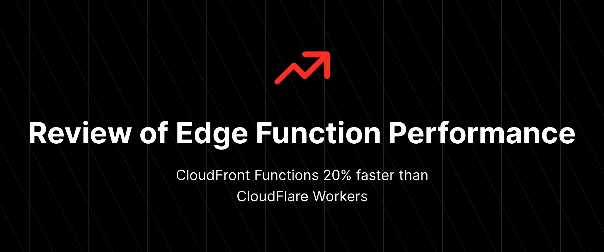
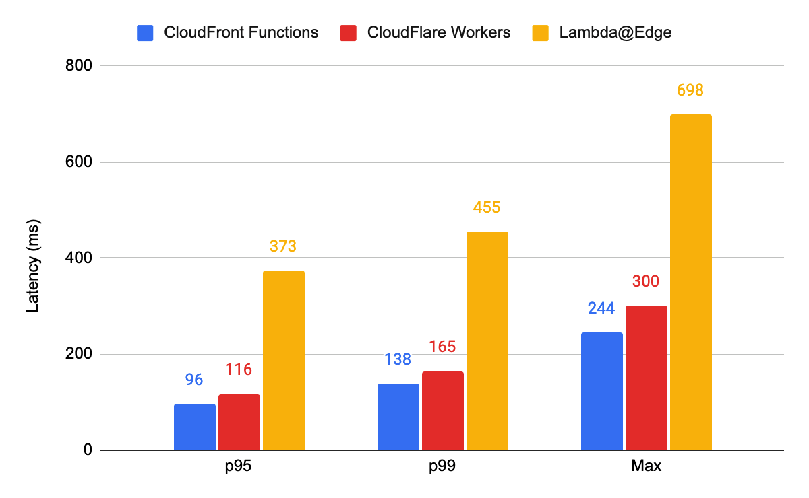
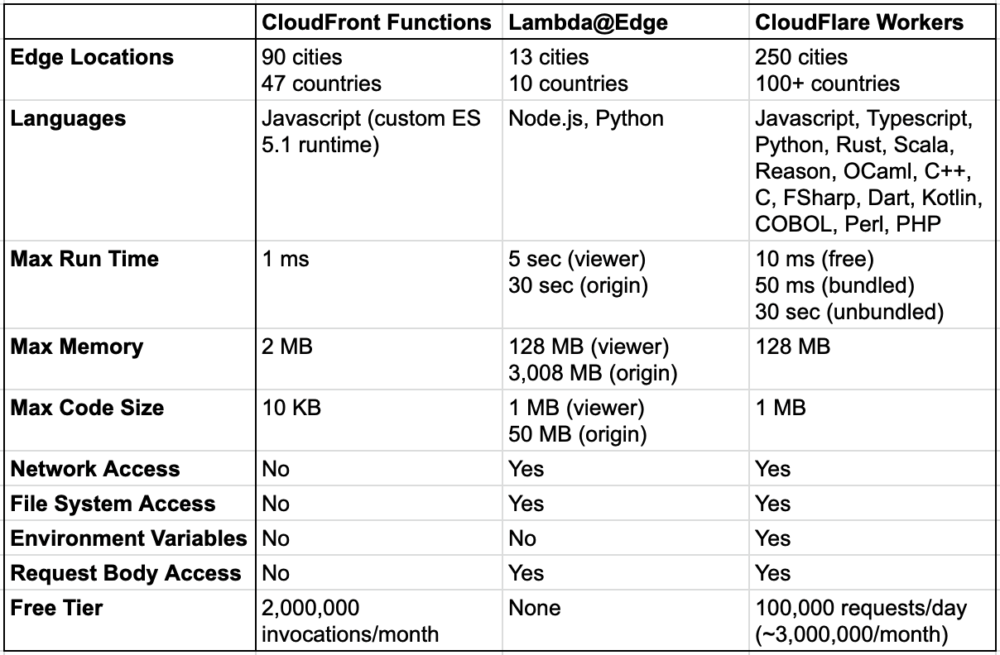
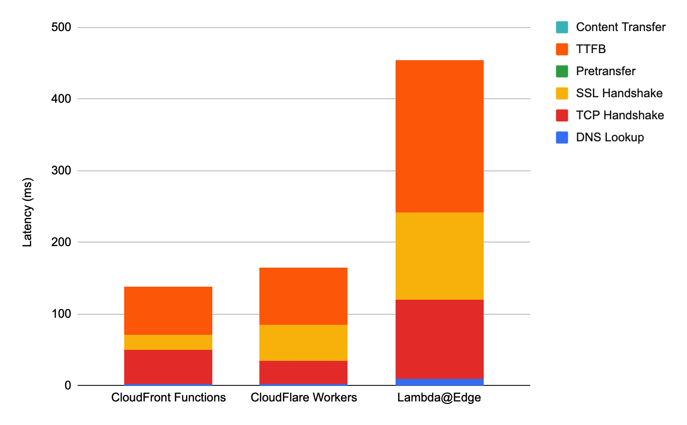
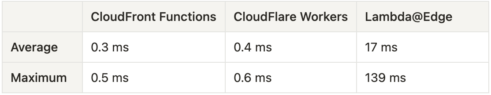
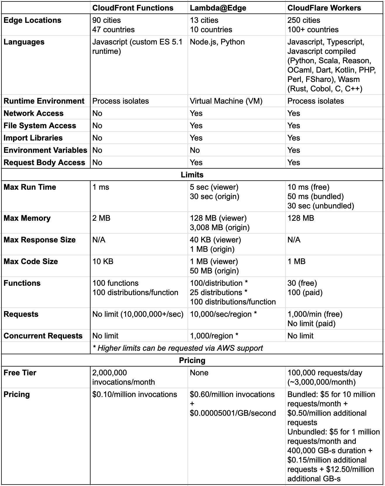
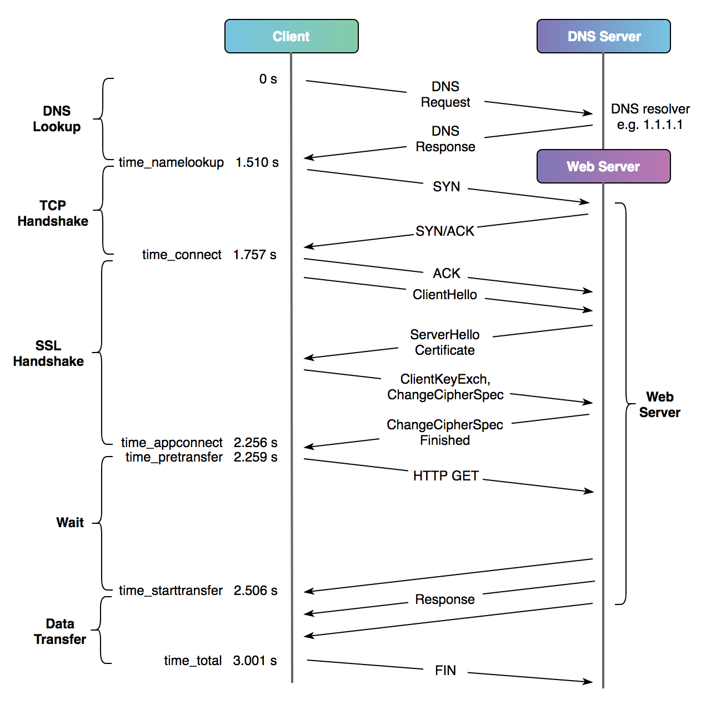

_This article was originally posted to [Medium](https://medium.com/@pauly4it/cloudfront-functions-20-faster-than-cloudflare-workers-230-faster-than-lambda-edge-c65c26221296) and [Dev.to](https://dev.to/pauly4it/cloudfront-functions-20-faster-than-cloudflare-workers-230-faster-than-lambdaedge-dg3). I'm adding this copy to the repo to keep everything related to the post in one place._

How do the big 3 options to run code "at the edge" (CloudFront Functions and Lambda@Edge from AWS and Workers from Cloudflare) compare when it comes to performance?

That was the main question which came up when I started building a simple URL forwarding service (repo on [GitHub](https://github.com/pauly4it/cloudfront-short-url-redirect)). I was mainly interested in (and ended up choosing) CloudFront functions, but before deciding on a path forward I wanted some background on the performance characteristics of each option.

And my findings surprised me, with CloudFront Functions just barely beating out Cloudflare Workers:



But this isn't the whole story. Read on to find out what it means to run code at the edge, the differences between the 3 options, my testing methodology, my function code, a breakdown of the results, as well as caveats and next steps (use the table of contents below to jump between sections quickly).

**Table of Contents**

1. [Background: Code At The Edge](#background-code-at-the-edge)
2. [Seeking Performance](#seeking-performance)
3. [Testing Methodology](#testing-methodology)
4. [Function Code](#function-code)
5. [Performance Results Breakdown](#performance-results-breakdown)
6. [Caveats and Next Steps](#caveats-and-next-steps)
7. [Appendix](#appendix)

## Background: Code At The Edge
Running code "at the edge" refers to serving results from specialized functions running on servers closest to your users, rather than on servers at centralized data centers. This can result in greatly reduced latency (i.e., response times) of delivering content or logic by reducing the physical distance between the client (user) and the machine providing the result.

This is a similar concept used by many sites today to serve their static content (e.g., pages, images, videos) quickly to users. This is possible thanks to CDNs (Content Deliver Networks), which duplicate content to hundreds of server clusters (called edge locations or PoPs - Points of Presence) distributed throughout the globe, generally near major population centers or groups of population centers. Two of the most well-know CDN providers are AWS (Amazon Web Services) and Cloudflare.

Historically these CDNs could only cache (i.e., temporarily store) static content. If you wanted to provide dynamic behavior based on request parameters, user requests would need to be routed to a server (typically hosted in only a few dozen global data centers) to process the request parameters and return a dynamic response. This request cycle could end up taking several seconds, depending on the user's location, their network connection speed, the server's location, the data center's network speed, and the server's/application's performance.

Things changed in 2016 when [AWS launched Lambda@Edge](https://aws.amazon.com/blogs/aws/coming-soon-lambda-at-the-edge/) and in 2017 with [Cloudflare's launch of Cloudflare Workers](https://blog.cloudflare.com/introducing-cloudflare-workers/), allowing developers to execute code to make dynamic changes to users' requests and responses at edge locations closer to users. Then in May 2021, [AWS launched CloudFront Functions](https://aws.amazon.com/blogs/aws/introducing-cloudfront-functions-run-your-code-at-the-edge-with-low-latency-at-any-scale/), a new service offering even better performance and lower cost compared to Lambda@Edge, albeit with significantly limited capabilities.

These 3 services each fill the needs of specific use cases, and likely in many situations you wouldn't compare all 3 directly. For my specific use case, however, each service met my needs. As an overview, below are the major features and differences of each option ([additional details in the Appendix](#service-comparison)):



## Seeking Performance
I found it surprisingly difficult to find performance data for these services.

Cloudflare [claimed to be 192% faster than Lambda@Edge](https://blog.cloudflare.com/serverless-performance-comparison-workers-lambda/) while providing similar features in 2018, about a year after both services launched. They then updated their performance comparison in 2021 after improvements to their service, [claiming to be 210% faster than Lambda@Edge](https://blog.cloudflare.com/cloudflare-workers-the-fast-serverless-platform/). Those numbers seemed a bit too good to be true.

Looking for unbiased results of Lambda@Edge and CloudFront Function performance, I found only a handful, including:

- [Analysis of the performance cost of adding a Lambda@Edge function to a CloudFront distribution](https://www.lombax.it/2019/05/performance-cost-of-aws-lambdaedge-on-cloudfront/) by Fabio Lombardo showed a p99 latency of 203 ms (an increase of 189ms over a bare CloudFront distribution)
- Kevin W. McConnel's [CloudFront Function de-referer service performance evaluation](https://www.kevinwmcconnell.com/aws/faster-referer-service-cloudfront) showed a p99 latency of 165 ms

What I couldn't find, however, was an unbiased head-to-head-to-head performance comparison of the same function code on each service. And so, I took it upon myself to create this performance comparison.

## Testing Methodology
I decided to keep my performance tests simple, using curl to make requests to each of the 3 services hosting my function code to forward a short link request to the full URL (e.g., example.com/git forwarding to a specific GitHub repo). While I could have turned to tools like [Apache Bench](https://httpd.apache.org/docs/2.4/programs/ab.html), [Hey](https://github.com/rakyll/hey/), [Artillery](https://github.com/artilleryio/artillery/), or [Iter8](https://iter8.tools/) for more options and testing features, I wanted to use the most direct request method which would also allow me to see the raw data.

I settled on the following test parameters:

- Use javascript for the function code, as that was the only common language supported by all 3 services.
- Keep javascript code as similar as possible, though exact same code is not possible due to each service's quirks.
- Tests will run against HTTPS URLs to gauge each service's SSL performance.
- Tests will run against CloudFront and Cloudflare distribution URLs directly, removing any impact of third-party DNS lookup latency ([see Appendix for reasoning](#custom-sub-domain-issues)).
- Tests will run as GitHub Actions on hosted runners ([GitHub uses Azure for runners based on a 2021 forum response](https://github.community/t/github-runners-physical-location/162436)) rather than on a machine on my local network or on an EC2 instance, with the aim of reducing potential issues due to my local network and reducing any bias of EC2 instances which may have faster network connections to CloudFront edge locations.
- For each service, 100 requests will be made to 5 different paths:
    - root (`''`): no path to match
    - slash (`'/'`): no path to match
    - random (`'/foo'`): path provided doesn't match any short link
    - link1 (`'/link1'`): path provided matches the first short link
    - link2 (`'/link2'`): path provided matches the second short link
- Latency is not a normal distribution, meaning the commonly used mean (average) and standard deviation values are meaningless in this case. We want to see what the majority of users will experience, so we'll calculate the p95, p99, and maximum values across the 500 requests for each service (the maximum values are important as they inform us of worst-case scenarios). Additional background can be found in the Appendix.
- Curl will not follow redirects, as we are testing the performance of receiving a redirect response rather than the performance of the redirect page.
- Curl's content output is not needed (i.e., does not need to be written to a file), as no body content is returned by the function response.
- Curl's built-in performance metrics will provide the total request time in addition to times for DNS Lookup, TCP Handshake , SSL Handshake, Pretransfer, TTFB, and Content Transfer ([see definitions in Appendix](#curl-performance-metrics)):

```sh
curl -w '%{time_namelookup},%{time_connect},%{time_appconnect},%{time_pretransfer},%{time_starttransfer},%{time_total}' -o /dev/null -s https://example.cloudfront.net
```

You can find an example of the GitHub workflow code in this article's accompanying repo in the tests directory: https://github.com/pauly4it/blog-post-edge-functions/tree/main/tests

## Function Code

I initially wrote the function code for CloudFront Functions, as it's the most restrictive of the 3 options. The CloudFront Function restrictions, as well as wanting to reduce code complexity and code size, resulted in the following code decisions:

- The link map is hard-coded, rather than being pulled from environment variables or external sources.
- The function always returns an HTTP 302 Found redirect response either to the default redirect URL or a matching short link URL.
- The `https://` portion of each link does not need to be included in the default URL or short link map, and instead it is added in the response.

The code blocks below show the function code with the default redirect and short link maps replaced with examples rather than my personal site and personal redirects used in testing. These changes should not substantially affect results.

The function code is also available in this article's accompanying GitHub Repo in the functions directory: https://github.com/pauly4it/blog-post-edge-functions/tree/main/functions

### CloudFront Function

```javascript
function handler(event) {
    var request = event.request;
    var uri = request.uri;

    // Set response URL redirect
    var newLink = {
        'test': 'example.com',
        'bar': 'example.com/baz'
    }[uri.substring(1)] || 'github.com';

    // Log request data and redirect URL
    var output = {};
    output[request.method] = uri;
    output.Redirect = newLink;
    output.Headers = request.headers;
    console.log(output);

    // Return a 302 redirect
    return {
        statusCode: 302,
        statusDescription: 'Found',
        headers: {
            'location': {
                value: 'https://' + newLink
            }
        }
    };
};
```

_Note: CloudFront Function's Javascript runtime does not currently support const and let for variable definition._

### Lambda@Edge Function

```javascript
'use strict';
exports.handler = (event, context, callback) => {
   const request = event.Records[0].cf.request;
   const uri = request.uri;

   // Set response URL redirect
   const newLink = {
      'test': 'example.com',
      'bar': 'example.com/baz'
   }[uri.substring(1)] || 'github.com';

   // Log request data and redirect URL
   let output = {};
   output[request.method] = uri;
   output.Redirect = newLink;
   output.Headers = request.headers;
   console.log(output);

   // Return a 302 redirect
   const response = {
      status: 302,
      statusDescription: 'Found',
      headers: {
         location: [{
            key: 'Location',
            value: 'https://' + newLink,
         }],
      },
   };

   callback(null, response);
};
```

### Cloudflare Worker Script

```javascript
async function handleRequest(request) {
  const requestURL = new URL(request.url);
  const redirectMap = new Map([
    ['/test', 'example.com'],
    ['/bar', 'example.com/baz']
  ]);

  // Set response URL redirect
  const location = redirectMap.get(requestURL.pathname) || 'github.com';

  // Log request data
  console.log(new Map(request.headers));

  // Return a 302 redirect
  return Response.redirect('https://' + location, 302);
}

addEventListener('fetch', async event => {
  event.respondWith(handleRequest(event.request));
});
```

## Performance Results Breakdown

As I mentioned at the beginning of this post, CloudFront Functions just barely beat out Cloudflare Workers. But even Lambda@Edge's performance is still quite fast, coming in at under half a second at the p99 mark. The results for all three services are quite remarkable.


The rankings also held true for the minimum, average, and median values, though, as I mentioned earlier, these values are not useful when working with a multi-modal distribution and so they were not included in the graph.

A surprise from the results was that Cloudflare's claim of Workers performing 210% faster than Lambda@Edge at the 95th percentile was pretty much spot on (my results indicated Workers were 221% faster at p95). And given that Cloudflare Workers have about the same feature set as Lambda@Edge with the addition of a generous free tier, Workers' performance is even more impressive.

But what could be driving such a wide performance gap for Lambda@Edge? My theory is this is due to three factors:

1. Lambda@Edge suffers from Lambda function cold start delays due to running in VMs, while Cloudflare's Isolate Model cold start delay was only around 5 ms (which they [effectively reduced to zero in 2020](https://blog.cloudflare.com/eliminating-cold-starts-with-cloudflare-workers/)). If we remove the first result (cold start) from each Lambda@Edge path's 100 requests, that results in an average decrease of 32ms at p99 and 198 ms at the maximum latency. At the maximum latency, that's nearly a third of the response time!
2. Lambda@Edge is only distributed to CloudFront's 13 regional edge caches, whereas Cloudflare Workers run at 250+ edge locations.
3. There appear to be additional steps to the request process with Lambda@Edge when compared to Cloudflare Workers and CloudFront Functions (see the request phase breakdown below), as each request phase takes longer for Lambda@Edge.

Let's take a look at how the request phases break down for each service at p99:



Both CloudFront Functions and Cloudflare Workers took about the same time to process the request (67 ms and 79 ms, respectively), indicated by TTFB, but Lambda@Edge took 213 ms. The cold start time of 32 ms at p99 doesn't even come close to accounting for the slower processing of Lambda@Edge. But what's even more clear is that's not the only problem Lambda@Edge has, with the DNS Lookup, TCP Handshake, and SSL Handshake phases taking 5.2 times, 2.3 times, and 5.8 times longer, respectively, when compared to CloudFront Functions.

Looking at just CloudFront Functions and Cloudflare Workers, what's interesting is that the combined DNS Lookup, TCP Handshake, and SSL Handshake process for Cloudflare took only 15 ms longer than CloudFront Functions, with Cloudflare's TCP Handshake actually completing 32% faster than CloudFront's. If Cloudflare improves their SSL Handshake time, they could easily match or beat CloudFront Functions' performance. That said, a difference of 27 ms at p99 between CloudFront Functions and Cloudflare Workers is not much of a difference in absolute terms (though in relative terms that comes out to CloudFront Functions performing 20% faster).

Let's also take a look at duration at the function level ([see Appendix for notes on duration values](#function-duration-reporting)):



Holy smokes, look at those Lambda@Edge numbers! And that Lambda@Edge average duration value is a global average. The region-level averages were even more concerning for Lambda@Edge, with some region's average durations topping 70+ ms. This is where CloudFront Functions and Cloudflare Workers absolutely crush Lambda@Edge, both always finishing well under a millisecond. This means the same logic took Lambda@Edge up to 230% longer to process, and with Lambda@Edge's pricing model, that means you're paying for each additional millisecond of run time. And, to be clear, Lambda@Edge cold starts do not affect these duration values. This is purely driven by the VM-based model used by Lambda@Edge and the inherent performance of the Node.js runtime.

Ultimately, CloudFront Functions and Cloudflare Workers are the best options of the three for most use cases. For simple code like my short link forwarder, CloudFront Functions provides slightly better performance with significantly better logging and metrics reporting compared to Cloudflare Workers. For anything more complex than that, I'll most likely be turning to Cloudflare Workers in the future to take advantage of the generous free tier, better feature support when compared to CloudFront Functions, and a more pleasant developer experience. I would only consider using Lambda@Edge when I would need tighter integrations with multiple other AWS services, though I'm not sure where the break-even point with Cloudflare Worker performance would land.

If you'd like to check out the raw performance data, you can find it in this article's accompanying GitHub repo in the data directory: https://github.com/pauly4it/blog-post-edge-functions/tree/main/data

## Caveats and Next Steps

This performance test is by no means exhaustive, and no performance test can give you "perfect" results. For my use case, a personal short link forwarding service, I believe this test provides results which reflect what most of my mainly US-based users would experience when visiting one of my short links. And since these functions are quite basic, with low complexity, these results should be indicative of the raw performance of each service.

I have identified a few items which may have had an impact on results and how I plan to address them in the future:

- Curl and most browsers these days append the / to the end of URLs, even if you don't type it. That means the root and slash path tests were effectively the same test run twice. In the next iteration of this test process, I would remove the root path test.
- Related to the above, running the tests against 4 or 5 different paths might not provide data of significantly different value. I'll need to do a bit of digging to determine any code-level performance differences of different paths and potentially adjust the test suite.
- I found that each job in a GitHub Actions workflow may not run in the same region. For example, on one Lambda@Edge test run, four jobs resulted in request records in us-west-2 and the remaining job resulted in us-east-2 request records. Since GitHub doesn't allow you to specify hosted runner regions for a workflow, an alternate non-AWS, non-Cloudflare, and non-GitHub solution may be needed.
- Expanding on the above, running the test suite simultaneously in multiple regions would provide better generalized results and average out any performance differences between edge locations. I would likely start with US-only regions based on my use case, but I'm curious to see the performance results for non-US locations as well.
- Tests were run only at one time of the day, measuring performance only at that time over the course of less than a minute. Performance of each service and GitHub Actions likely fluctuates some amount during the course of the day. For the next test iteration, I would set up the test steps to run at a random time each hour for 24 hours. I could even run the test over the course of the week, though that would probably only provide very marginal benefits for results.

What are your thoughts? I'd like to hear from you about ideas to improve this testing strategy.

## Appendix

### Service Comparison

It's difficult to compare the 3 services directly since they have different pricing models and features based on the intended use case. The high-level table I put together is my attempt to compare the services as closely as possible to each other, though there are more details which may be pertinent to certain use cases. Here's a more detailed comparison table:



That said, some of the details in the table may be a bit confusing, especially when you look at pricing. Let's take a deeper dive into each service.

#### _CloudFront Functions_

CloudFront Functions use a process-based isolation model for their runtime environment rather than a VM-based model like Lambda@Edge. Though AWS does not provide details on this process-based isolation model, it appears to be similar to Cloudflare's Worker V8 engine isolate model.

CloudFront Functions can only be triggered by viewer requests and responses on distributions, meaning they are triggered for every request or response which matches the associated cache behavior on the distribution. The default cache behavior matches all requests, however you can specify behavior patterns which match specific paths or file types (up to a maximum of 25 cache behaviors per distribution).

Currently, CloudFront Functions only supports [ECMAScript v5.1 javascript with specific features added from newer ES versions and some non-ES features](https://docs.aws.amazon.com/AmazonCloudFront/latest/DeveloperGuide/functions-javascript-runtime-features.html). If you've worked with javascript any time over the last 5 years, you'll find the CloudFront Functions javascript runtime a bit limiting. For context, ES5.1 was published in 2011, and the more commonly known ES20XX naming style (e.g., ES2020) started in 2015 with the release of ES6 (ES2015).

Thankfully, it seems AWS made an effort to add support for some useful features from newer ES versions up to ES9/ES2018 (e.g., ES6/ES2015 arrow functions and template literals) while still balancing the restricted environment. That said, two major features used in modern javascript which are missing: let and const (only var is available).

Some other quirks include:

- No dynamic code evaluation using `eval()` or `Function`
- Timers are not supported, requiring all code to run synchronously to completion
- No access to high-resolution timestamps, resulting in any Date queries to always return the datetime at which the function started
- No ability to import libraries (except `crypto` and `querystring`)
- Functions always operate in strict mode (e.g., undeclared variables not allowed), with no need to add `use strict` yourself to your code

Pricing is straightforward: $0.10 per million invocations above the 2 million free invocations. So for 3 million invocations, you would pay only $0.10.

#### _Lambda@Edge_

Lambda@Edge can be triggered by either viewer events or origin events (both trigger types include request and response events), and the triggers chosen affect the maximum run time and maximum code size, as shown in the above table. Viewer events are triggered for every request or response which matches the associated cache behavior on the distribution. Origin events are triggered on matching cache behaviors for requests and responses which do not hit the CloudFront cache and reach the origin (i.e., cache misses). Just like with CloudFront Functions, a distribution can have 25 cache behaviors maximum.

Note that Lambda@Edge does not support some commonly-used Lambda features, such as:

- VPC association
- Dead letter queues
- Environment variables
- Lambda Layers
- AWS X-Ray
- Reserved and provisioned concurrency
- Container images
- Arm64 architecture support

Lambda@Edge pricing it a bit more complex, as you now pay not only for invocations but also for the duration and memory used. For example, if your function uses the 128 MB memory minimum, runs an average of 20 ms per invocation, and is invoked 3 million times per month, then your monthly cost would be $2.18.

#### _Cloudflare Workers_

Cloudflare Workers execute code using the Chrome V8 runtime engine, which translate javascript directly to machine code. This allows Cloudflare to run Worker scripts in process isolates, similar to CloudFront Functions. Using the V8 engine likely also drives Workers' native support for Javascript and Web Assembly.

Cloudflare lists language support for 13+ different languages for Workers, however it really only directly supports Javascript and Web Assembly (Wasm). The other 11+ languages must be compiled down to either Javascript or Wasm. That caveat wasn't exactly clear at first, but I appreciate that Cloudflare offers the tools to use a wider variety of programming languages to work with Workers.

Cloudflare offers three different plan types for Workers, which affect the allowed maximum runtime of your Workers. The free plan is easy to understand, but the bundled and unbundled plans less so.

At a high level, the bundled plan bills usages based on requests, while the unbundled plan bills usage based on requests as well as Worker duration, which then enables Cloudflare to offer higher limits for unbundled Workers. On the free plan, the maximum script run time is 10ms, which Cloudflare claims is enough for most uses (and that aligns with my function's performance). The paid bundled and unbundled plans increase the maximum run time to 50 ms and 30 seconds, respectively.

The bundled pricing plan is pretty straightforward, while the unbundled pricing plan is similar to pricing for Lambda@Edge. If we use the same function values from the Lambda@Edge pricing example (128 MB, 20 ms run time, and 3 million invocations), the cost difference between the two plans is minimal:

- Bundled: $5.00
- Unbundled: $5.30

Realistically, though, for my personal short link forwarding script, the free plan is more than adequate.

#### _References_

- [AWS: Customizing at the edge with functions](https://docs.aws.amazon.com/AmazonCloudFront/latest/DeveloperGuide/edge-functions.html)
- [Introducing CloudFront Functions - Run Your Code at the Edge with Low Latency at Any Scale](https://aws.amazon.com/blogs/aws/introducing-cloudfront-functions-run-your-code-at-the-edge-with-low-latency-at-any-scale/)
- [JavaScript runtime features for CloudFront Functions](https://docs.aws.amazon.com/AmazonCloudFront/latest/DeveloperGuide/functions-javascript-runtime-features.html)
- [CloudFront Function Quotas](https://docs.aws.amazon.com/AmazonCloudFront/latest/DeveloperGuide/cloudfront-limits.html#limits-functions)
- [CloudFront Function Restrictions](https://docs.aws.amazon.com/AmazonCloudFront/latest/DeveloperGuide/edge-functions-restrictions.html#cloudfront-function-restrictions)
- [Lambda@Edge Quotas](https://docs.aws.amazon.com/AmazonCloudFront/latest/DeveloperGuide/cloudfront-limits.html#limits-lambda-at-edge)
- [Lambda@Edge Restrictions](https://docs.aws.amazon.com/AmazonCloudFront/latest/DeveloperGuide/edge-functions-restrictions.html#lambda-at-edge-function-restrictions)
- [CloudFront Pricing](https://aws.amazon.com/cloudfront/pricing/)
- [Cloudflare Docs: How Workers works](https://developers.cloudflare.com/workers/learning/how-workers-works/)
- [Cloudflare Workers Pricing](https://developers.cloudflare.com/workers/platform/pricing/)
- [Cloudflare Workers Limits](https://developers.cloudflare.com/workers/platform/limits/)

### Custom Sub-Domain Issues

Initially I ran tests against a custom sub-domain (using DreamHost name servers) tied to my distributions, however I found that the first request in each set of 100 was always slower by at least 100 ms and 50% of the time it was a whole 5 seconds slower. Curl metrics showed this was always the fault of the `time_namelookup` phase (ie., DNS lookup).

This made it clear to me that 1) I need to find a new DNS host and 2) running tests directly against the distribution domains would provide a clearer test of each service's performance.

### Curl Performance Metrics

Understanding curl's request metrics, and HTTP request metrics in general, can be difficult. Curl's manual page didn't shed much light on these metrics, but I luckily found Speed Test Demon's post [Cheat Sheet on Curl Performance Metrics](https://speedtestdemon.com/a-guide-to-curls-performance-metrics-how-to-analyze-a-speed-test-result/) which cleared up my remaining questions.

As part of my testing methodology, I calculated the following values using the metrics provided by curl on each request:

- DNS Lookup (`time_namelookup`): time to translate a domain name to an IP Address with the DNS server
- TCP Handshake (`time_connect - time_namelookup`): time for the three-way TCP handshake with the server, generally also a good approximation for the RTT (Round Trip Time)
- SSL Handshake (`time_appconnect - time_namelookup`): time for TLS setup and certificate exchange
- Pretransfer (`time_pretransfer - time_appconnect`): time for curl to setup functionality specific to the protocol involved (should be nearly 0)
- TTFB (`time_starttransfer - time_pretransfer`): time to first byte, or the time the server spent preparing the response to the request
- Content Transfer (`time_total - time_starttransfer`): time for all content to transfer from the server to the client (should be nearly 0 for these tests)

These names/values can seem a bit nebulous, and I often find a visual representation of these types of flows most helpful:


Source: [A Question of Timing](https://blog.cloudflare.com/a-question-of-timing/) from the Cloudflare blog

### Function Duration Reporting

Unlike Lambda@Edge, CloudFront Functions and Cloudflare Workers do not directly report function duration. CloudFront Functions report Compute Utilization, a percentage of maximum allowed run time (i.e., 1 ms). Cloudflare Workers report CPU Time per execution (in ms) and Duration per execution (in GB-s). For our purposes, the function duration will be calculated for CloudFront Functions by multiplying 1 ms by the Compute Utilization percentage and for Cloudflare Workers by directly using the CPU Time per execution.

A further complication for comparisons, CloudFront Functions and Lambda@Edge provide average and maximum duration values via CloudWatch, while Cloudflare provides p50 (median) and p99.9 values in the Workers dashboard. For our comparison purposes, I am assuming these are equivalent measures (i.e., average ≈ median and maximum ≈ p99.9).
